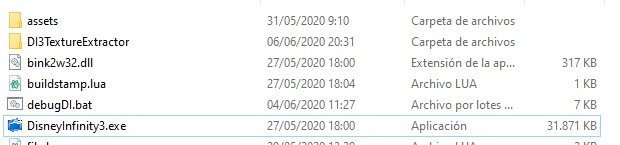
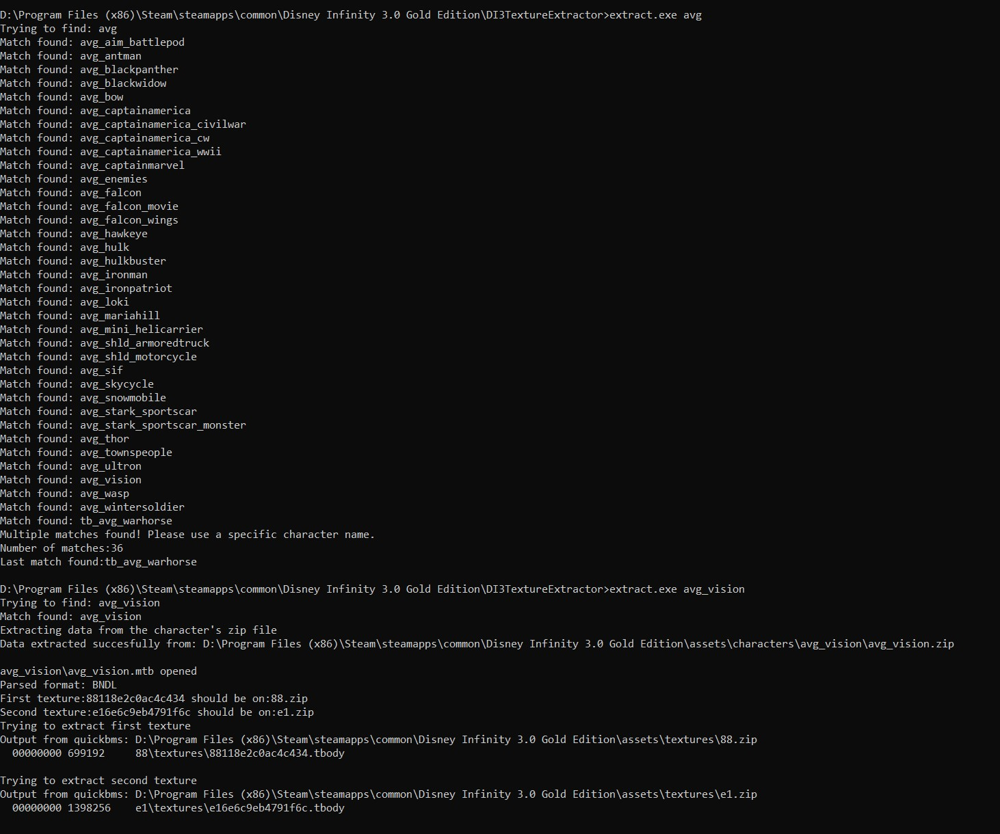

# DI3TextureExtractor
Tool for extracting character textures from the DI3 game


## DISCLAIMER
Backup all your files before executing this program. This software is provided without any kind of warranty. You have been warned

## How to install
Download all the files and put them on a folder in the same directory that DisneyInfinity3.exe resides.
If you dont put it on that place it will not work. 



## How to compile it
This tool is coded in golang just because it will create a nice and portable exe file. This is the first time coding with this language and probably it has a LOT of bugs. Feel free to create pull requests. :)

```
go build extract.go
```

## How to use
Open a command prompt on the directory that extract.exe resides.
The program expects a single parameter that will be the name of the file of the character that we want to find and extract the textures.
If we use a partial name, it will list all the filenames that contain it.
If there is only one match, it will start extracting the model files and also will try to find the textures.

The files will be extracted on a folder with the character name.


## Known bugs
If we want to extract a character that has variations like avg_captainamerica or avg_falcon, it will always return more than one matches and it will not work. This will be fixed in the future. - FIXED Already

There are some model files that already have some textures embeded. The tool will fail extracting the textures from the textures folder because it cannot find them... Just check the folder and subfolders of the extracted files and you will find them.

